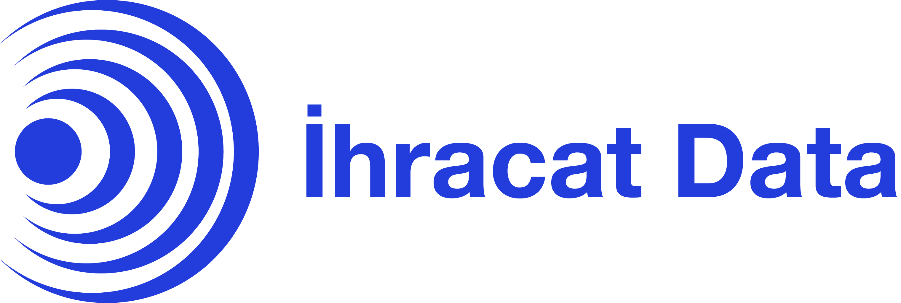

# Merhaba, Ben **Buğrahan Özdemir** 

## Markalarım 🌠

<table>
  <tr>
    <td align="left">
    

      
      <h3><strong>Han Ticari Yatırım</strong>®</h3>
      
Yeni nesil girişimcilik.
      

      
İncele: <a href="https://hanticariyatirim.com" target="_blank">www.hanticariyatirim.com</a>

      

    </td>
  </tr>
  <tr>
    <td align="left">
    

      
      <h3><strong>İhracat Data</strong>®</h3>
      
İhracat Data’nın sertifikalı veritabanında bulunan yurtiçi ve yurtdışı firmalar ile şirketinizi tüm dünyada tanıtın!
      

      
İncele: <a href="https://ihracatdata.com" target="_blank">www.ihracatdata.com</a>

      

    </td>
  </tr>

  <tr>
  <td>
  

      
      <h3><strong>Avensa Dijital</strong>®</h3>
      
Firmanızın dijital dünyada ihtiyacı olan tüm çözümlerimiz ile işinizin her zaman destekçisiyiz.
      

      
İncele: <a href="https://avensa.com.tr" target="_blank">www.avensa.com.tr</a>

      

  </td>
  </tr>
</table>

## İletişim 👋🏼

  
  
  
  
  

    
## Teknolojiler ⚙️
    

<!-- ## My Experiences🙌🏼

- [GSSOC'21 Participant](https://github.com/Astrodevil/Astrodevil/blob/main/src/Certificate%20-%20Amitesh%20Anand.png): Contributed to some projects, mainly based on Web Development.
- [Hacktoberfest-2021](https://hacktoberfest.digitalocean.com/): Participated as maintainer.
- [MLH Hackathons](https://mlh.io/): Participated in [Local Hack Day: Build](https://organize.mlh.io/participants/events/6072-local-hack-day-build) and [Local Hack Day: Share](https://organize.mlh.io/participants/events/6430-local-hack-day-share).
- [GoogleCloudReady Facilitator Program](https://events.withgoogle.com/googlecloudready-facilitator-program/enrol-in-the-program/#content): Completed Labs and challenges in [Qwiklabs](https://www.qwiklabs.com/public_profiles/f3d65b58-4359-4795-96da-1241061ad207).

[
 ]:# -->

## İstatistikler📈

 

